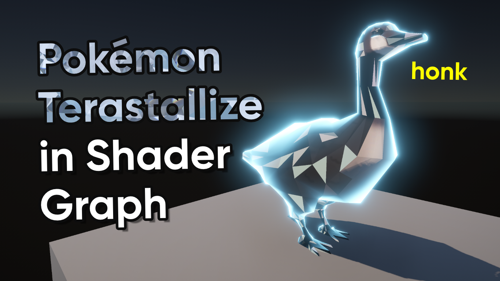

# Terastallize Effect in Unity Shader Graph

A Terastal shader for Unity based on the Terastallizing game mechanic from Pokemon Scarlet and Violet

## Overview

## Software

This project was created using Unity 2022.3.0f1 (Long-Term Support).

## Tutorials

This project is part of a tutorial which is available here:

- Coming Soon!

## Authors

This project and the corresponding tutorials were created by Daniel Ilett.

## Release

This project was released sometime in the future.
